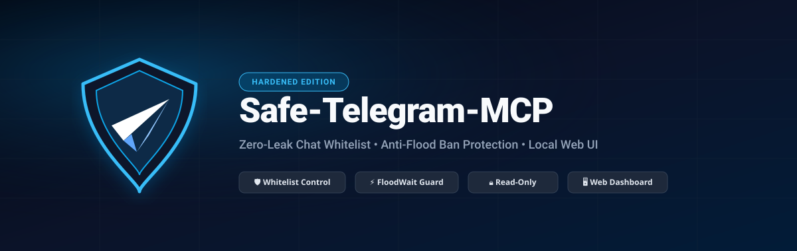

<p align="center">
  
</p>

<div align="center">

[](https://devsponsors.github.io)
[](https://devsponsors.github.io)

[](LICENSE)

[English Documentation](README.md) • **راهنمای فارسی**

</div>

> 🛡️ **Safe-Telegram-MCP**: نسخه امن‌سازی و مقاوم‌شده (Hardened) از سرور پروتکل کانتکست مدل تلگرام (Telegram MCP) مجهز به لیست سفید چت‌ها، محافظت در برابر مسدودی و بن خودکار (Anti-Flood)، حالت فقط‌خواندنی، و داشبورد مدیریت تحت وب لوکال.

---

## 🌟 چرا نسخه Safe-Telegram-MCP؟

اتصال مستقیم مدل‌های هوش مصنوعی (مانند Claude Desktop، Cursor، Windsurf یا Codex) به اکانت تلگرام از طریق کتابخانه‌های MTProto معمولاً **دسترسی نامحدود به کل اکانت** ایجاد می‌کند. این موضوع خطرات حیاتی دارد:

1. **نشت اطلاعات محرمانه (Data Leakage):** مدل هوش مصنوعی می‌تواند چت‌های خانوادگی، کاری، پیام‌های خصوصی و کدهای اعتبارسنجی در Saved Messages را بخواند.
2. **تزریق پرامپت ناخواسته (Indirect Prompt Injection):** یک پیام مخرب ارسالی از طرف دیگران در گروه‌ها می‌تواند هوش مصنوعی را وادار به ارسال پیام‌های ناخواسته یا سرقت داده‌های شما کند.
3. **بن و مسدودی اکانت تلگرام (`FloodWaitError` یا `PHONE_NUMBER_BANNED`):** ارسال کوئری‌های بزرگ و رگباری توسط هوش مصنوعی، فیلترهای ضداسپم تلگرام را فعال و شماره را مسدود می‌کند.

**Safe-Telegram-MCP** یک لایه امنیتی هوشمند و بدون نیاز به اینترنت خارجی بین هوش مصنوعی و تلگرام شما قرار می‌دهد.

---

## 🛡️ قابلیت‌های کلیدی نسخه Hardened

### ۱. 📋 لیست سفید چت‌ها (Chat Whitelist)
- **دسترسی صفر به‌صورت پیش‌فرض:** مدل هوش مصنوعی فقط می‌تواند به چت‌ها و گروه‌هایی که خودتان صریحاً تأیید کرده‌اید دسترسی داشته باشد (مانند `me`، `@channel` یا آیدی عددی چت).
- **مسدودسازی پیش از شبکه:** اگر هوش مصنوعی تلاش کند به پیوی شخصی دیگران یا چت‌های خارج از لیست مجاز سرک بکشد، درخواست در لایه MCP در همان لحظه مسدود شده و هیچ پیامی به تلگرام ارسال نمی‌شود.
- **استفاده ایمن از Saved Messages:** با نوشتن `me`، هوش مصنوعی را منحصراً به یادداشت‌ها و پیام‌های ذخیره‌شده خودتان محدود کنید.

### ۲. ⚡ مهار تاخیر و جلوگیری از بن شدن (Anti-Flood Rate Limiting)
- **وقفه هوشمند (۱.۵ الی ۲.۰ ثانیه):** ایجاد فاصله زمانی الزامی بین هر درخواست هوش مصنوعی تا ترافیک اکانت شما به عنوان رفتار اسپم یا بات تلقی نشود.
- **محدودسازی حجم اسکن:** هر درخواست دریافت پیام به سقف ۵۰ پیام محدود می‌شود تا خطای سنگینی کوئری در تلگرام رخ ندهد.
- **جلوگیری از ارسال پیام به غریبه‌ها (Anti-Peer Flood):** ارسال پیام به کاربرانی که در لیست مخاطبان شما نیستند ممنوع می‌شود.

### ۳. 🔒 حالت فقط خواندنی (Read-Only Guard)
- با فعال‌سازی این سوییچ، هرگونه عملیات تغییر، ارسال پیام، حذف پیام یا تغییر دسترسی‌های ادمین مسدود می‌شود و هوش مصنوعی فقط نقش تحلیل‌گر و پاسخ‌دهنده را ایفا می‌کند.

### ۴. 🖥️ پنل مدیریت وب لوکال دو زبانه (`--ui`)
- مدیریت تنظیمات، افزودن و حذف چت‌های مجاز و مشاهده وضعیت نشست از طریق یک صفحه وب با تم تاریک، دو زبانه (فارسی با فونت وزیرمتن / انگلیسی) و با پورت‌یاب خودکار.

---

## ⚡ راه‌اندازی سریع در ۳ گام ساده

### گام ۱: نصب و اجرای خودکار پنل (۱ دستور در ترمینال)
```bash
git clone https://github.com/ketabchi-ar/Safe-Telegram-MCP.git && cd Safe-Telegram-MCP && ./install.sh
```

### گام ۲: تنظیم کلید و اسکن QR در مرورگر
۱. در پنل وب باز شده، دکمه **🔑 کلیدهای API** را بزنید و روی **«استفاده از کلیدهای رسمی دسکتاپ»** کلیک کنید.  
۲. دکمه **📲 ورود QR** را بزنید و کد ظاهر شده را با اپلیکیشن تلگرام گوشی اسکن کنید (*تنظیمات تلگرام > دستگاه‌ها > اتصال دستگاه*).  
۳. چت‌های مجاز را به لیست سفید (Whitelist) اضافه کنید (مثلاً `me` برای دسترسی به پیام‌های ذخیره‌شده یا آیدی کانال‌های کاری).

### گام ۳: اتصال به Hermes Agent (یا سایر مدل‌ها)
کافیست در ترمینال دستور زیر را اجرا کنید:
```bash
printf "Y\n" | hermes mcp add telegram --command uv --args --directory ~/Safe-Telegram-MCP run main.py
```
*(برای کلاینت‌های دیگر مثل Claude Desktop یا Cursor به [بخش راهنمای کلاینت‌ها](#-نحوه-اتصال-سرور-mcp-به-کلاینت‌های-هوش-مصنوعی-hermes-claude-cursor) مراجعه کنید).*

---

## 🛠️ جعبه‌ابزار ۲۲۷ کاره تلگرام: چه کارهایی می‌توان با هوش مصنوعی انجام داد؟

سرور **Safe-Telegram-MCP** مجموعه‌ای از **۲۲۷ ابزار تخصصی** را در اختیار هوش مصنوعی قرار می‌دهد که همگی تحت نظارت لیست سفید امنیتی شما کار می‌کنند:

- **💬 پیام‌ها و گفت‌وگوها:** ارسال، ویرایش، حذف، فوروارد بدون نام، ریپلای، زمان‌بندی پیام‌ها (`schedule_message`) و مدیریت پیش‌نویس‌ها (`save_draft`).
- **📌 پیام‌های ذخیره‌شده (Saved Messages):** خواندن، نوشتن و دسته‌بندی بوک‌مارک‌ها و یادداشت‌های شخصی (`me`).
- **📢 کانال‌ها و سوپرگروه‌ها:** پایش پست‌ها، مدیریت تاپیک‌های فروم، ساخت لینک‌های دعوت، و مدیریت دسترسی‌ها.
- **📁 رسانه‌ها، فایل‌ها و ویس:** آپلود و دانلود فایل‌ها، ارسال ویس، ویدیو، آلبوم تصاویر، استیکر و فایل‌های حجیم.
- **🔒 چت‌های محرمانه (Secret Chats):** پشتیبانی کامل از پروتکل رمزنگاری سرتاسری MTProto 2.0، ارسال پیام‌های خودتخریب‌شونده با تایمر و ذخیره محتوای موقت.
- **👥 مخاطبین و اکانت:** جستجو در دفترچه تلفن، بررسی وضعیت آنلاین بودن و مدیریت سشن‌ها.
- **🤖 نظرسنجی و تعامل هوشمند:** ایجاد نظرسنجی، کلیک روی دکمه‌های شیشه‌ای ربات‌ها (`click_button`)، مینی‌اپ‌ها و ترجمه پیام‌ها.

### 💡 چند سناریوی کاربردی و واقعی:
1. **دستیار مدیریت وظایف شخصی:**  
   *«هرمس، یادداشت‌های اخیر من در Saved Messages تلگرام رو بخون، وظایف امروز رو استخراج کن و برام مرتب کن.»*
2. **ثبت خودکار خروجی کارها:**  
   *«خلاصه این جلسه کاری / کد نوشته شده رو برام داخل Saved Messages تلگرام ارسال کن.»*
3. **پایش و رصد خودکار کانال‌ها:**  
   *«کانال @team_updates رو بررسی کن و اگر اطلاعیه یا تسک جدیدی مطرح شده خلاصه‌اش رو بهم بگو.»*
4. **زمان‌بندی پیام‌ها:**  
   *«این پیام تبریک یا گزارش پروژه رو برای فردا ساعت ۱۰ صبح در کانال کاری زمان‌بندی کن.»*

---

## 🤖 نحوه اتصال سرور MCP به کلاینت‌های هوش مصنوعی (Hermes, Claude, Cursor)

پس از اینکه ورود از طریق داشبورد انجام شد، سشن در فایل `.env` ذخیره می‌شود. اکنون می‌توانید سرور را به مدل‌های هوش مصنوعی خود متصل کنید:

### ۱. اتصال به Hermes Agent
کافیست در ترمینال دستور زیر را اجرا کنید (یا در صورت پرسش، کلید Y را بزنید):
```bash
printf "Y\n" | hermes mcp add telegram --command uv --args --directory ~/Safe-Telegram-MCP run main.py
```

### ۲. اتصال به Claude Desktop
فایل تنظیمات کلاد دسکتاپ را باز کنید:
- **مک:** `~/Library/Application Support/Claude/claude_desktop_config.json`
- **ویندوز:** `%APPDATA%\Claude\claude_desktop_config.json`

و بخش زیر را در `mcpServers` اضافه کنید:
```json
{
  "mcpServers": {
    "safe-telegram": {
      "command": "uv",
      "args": [
        "--directory",
        "/path/to/Safe-Telegram-MCP",
        "run",
        "main.py"
      ]
    }
  }
}
```

### ۳. اتصال به Cursor / Windsurf / VS Code
در بخش تنظیمات MCP، سرور جدید از نوع `command` اضافه کرده و دستور `uv` به همراه آرگومان‌های بالا را وارد کنید.

---

## 🎯 بعد از اتصال، هوش مصنوعی به چه چیزهایی دسترسی دارد؟

مدل هوش مصنوعی به بیش از **۲۰۰ ابزار تخصصی تلگرام** دسترسی پیدا می‌کند، اما **با امنیت کامل و محدود به لیست سفید شما**:

- **دسترسی به Saved Messages (`me`):** اگر در پنل `me` را تیک زده باشید، می‌توانید به مدل بگویید:
  - *«آخرین یادداشت‌هایی که در پیام‌های ذخیره‌شده تلگرامم ذخیره کردم رو بخون و خلاصه کن.»*
  - *«این متن یا وظایف کاری رو برام بفرست توی Saved Messages تلگرام.»*
- **جستجو در کانال‌ها یا گروه‌های مجاز:**
  - *«آخرین پیام‌های کانال کاری @mychannel رو تحلیل کن ببین مهم‌ترین اطلاعیه‌ها چی بودن.»*
- **حفاظت کامل حریم خصوصی:** اگر هوش مصنوعی تلاش کند به پیام‌های خصوصی خانوادگی، بانکی یا چت‌های خارج از لیست سفید شما دسترسی پیدا کند، درخواست در همان لحظه توسط فایروال داخلی مسدود شده و خطای `[SECURITY GUARD BLOCKED]` ثبت می‌شود.

---

## 💡 آیا نیاز به نصب تلگرام دسکتاپ است؟
**خیر! اصلاً نیازی به نصب برنامه تلگرام دسکتاپ روی سیستم نیست.**  
شناسه رسمی دسکتاپ (`api_id=2040`) صرفاً یک امضای پروتکل MTProto در سرورهای تلگرام است. این ابزار بدون هیچ وابستگی، روی **macOS، لینوکس، ویندوز و حتی سرورهای ابری بدون محیط گرافیکی (Headless)** کار می‌کند.

---

## 🔐 راهکار طلایی: ورود امن بدون مغایرت IP و شناسایی دیوایس معتبر

برای اینکه تلگرام نشست هوش مصنوعی شما را مشکوک نداند و اخطار امنیتی صادر نکند:

1. **لاگین با اسکن QR Code (بهترین روش):**  
   به جای درخواست کد پیامکی (SMS)، دستور زیر را اجرا کرده و کد QR ظاهر شده را با اپ تلگرام گوشی اسکن کنید:
   ```bash
   uv run session_string_generator.py --qr
   ```
   *علت:* تلگرام اسکن کیوآرکد را به عنوان «تأیید حضوری دستگاه» می‌شناسد و کمترین نرخ ریسک امنیتی را برای آن ثبت می‌کند.

2. **تنظیم هویت دستگاه معتبر (Device Spoofing):**  
   در فایل `.env` هویت نشست را هم‌نام با سیستم روزمره خود قرار دهید تا نشست نامعلومی نشان داده نشود:
   ```env
   TELEGRAM_DEVICE_MODEL="MacBook Pro"
   TELEGRAM_SYSTEM_VERSION="macOS 15.3"
   TELEGRAM_APP_VERSION="5.10.3"
   ```

3. **یکسان‌سازی IP از طریق پروکسی لوکال:**  
   اگر روی سیستم خود از پروکسی (Clash/V2Ray/Mihomo) استفاده می‌کنید، همان پورت را در `.env` قرار دهید تا ترافیک تلگرام دسکتاپ و این ابزار با IP دقیقاً یکسان به سرورهای تلگرام ارسال شود:
   ```env
   TELEGRAM_PROXY_TYPE=socks5
   TELEGRAM_PROXY_HOST=127.0.0.1
   TELEGRAM_PROXY_PORT=10808
   ```

---

## 🚨 راهنمای مواقع اضطراری و رفع بن تلگرام

| نوع مشکل | علت فنی | اقدام لازم |
| :--- | :--- | :--- |
| **`FloodWaitError`** | درخواست‌های متوالی در ثانیه | **به هیچ وجه تلاش مجدد نکنید.** صبر کنید تا زمان ثانیه‌شمار تمام شود؛ تلاش مکرر جریمه زمانی را دو برابر می‌کند. |
| **`PeerFloodError`** (ریپورت) | ارسال پیام به افراد خارج مخاطبین | وارد ربات رسمی [@SpamBot](https://t.me/SpamBot) شوید، دستور `/start` را بزنید و گزینه *This is a mistake* را انتخاب کنید. رفع محدودیت معمولاً ۲۴ الی ۴۸ ساعت زمان می‌برد. |
| **`PHONE_NUMBER_BANNED`** | مسدودی موقت شماره | ایمیل به `recover@telegram.org` و `login@telegram.org` با موضوع `Banned phone number: +98XXXXXXXXXX` و ارسال تیکت در [telegram.org/support](https://telegram.org/support). |

---

## لایسنس
توسعه یافته بر پایه لایسنس **GNU GPL v3 یا بالاتر**.
